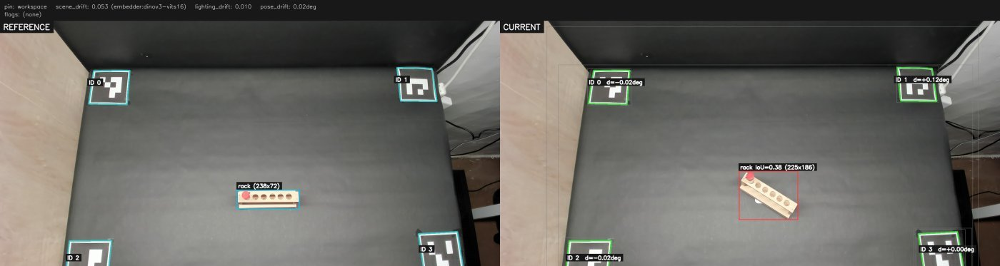
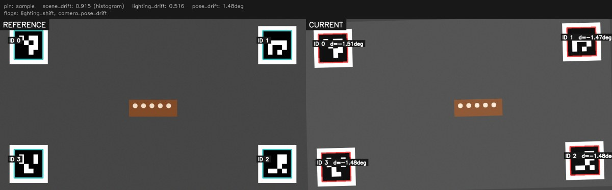

```
   █████╗ ███╗   ██╗██╗   ██╗██╗██╗
  ██╔══██╗████╗  ██║██║   ██║██║██║
  ███████║██╔██╗ ██║██║   ██║██║██║
  ██╔══██║██║╚██╗██║╚██╗ ██╔╝██║██║
  ██║  ██║██║ ╚████║ ╚████╔╝ ██║███████╗
  ╚═╝  ╚═╝╚═╝  ╚═══╝  ╚═══╝  ╚═╝╚══════╝
```

# Anvil — keep your scene true

A scene-consistency sentinel for robotics data collection. Pin a scene once;
every future session is checked against the pin. Drift gets flagged before it
gets baked into your dataset.

Sibling to [Forge](https://github.com/arpitg1304/forge): Forge shapes your data,
Anvil keeps your scene true.

> **Status:** v0.1.0 in active development. Schema is the only stable surface;
> CLI and internals will change until 0.1.0 ships.



> *A real `anvil check` diff after the test tube rack was moved between sessions. Reference (left) vs live frame (right) on the same overhead rig. The red bbox in the current panel marks the rack's new position with `IoU=0.38` against the pin; ArUco markers (green) confirm the camera itself didn't move. Header strip carries the Layer 1 scores; the per-object finding fires from Layer 2's GroundingDINO + DINOv3 region cosine.*

## Why Anvil

Every team training imitation policies or world models hits the same wall:
their policy generalizes worse than it should, and they can't tell whether
the cause is the model, the demonstrations, or the **conditions under which
the demos were collected**. Lighting drifted. The mat got nudged 4cm. Someone
replaced the red cup with a slightly different red cup. The camera mount
sagged 2° over a week of bumping.

That stochasticity is invisible at collection time and only shows up as a
15% drop in success rate three weeks later. By then, you can't tell which
demos are contaminated.

**Anvil's pitch:** treat the physical scene like source code. Pin a
known-good version. Every session, run a cheap automated check. Block (or
just tag) recording if drift exceeds threshold. Each episode gets stamped
with its deviation report, so when your policy fails you can correlate
failures with the conditions they were collected under.

## Install

v0.1.0 isn't on PyPI yet — install from source for now:

```bash
git clone https://github.com/arpitg1304/anvil && cd anvil

# Bare install: Layer 1 fast path (histogram + ArUco + lighting), guard,
# and the inspector UI. CPU-only, works on a laptop with a webcam.
uv sync --group dev

# Or, with the ML cascade — DINOv3 (scene embedding), DISK + LightGlue
# (marker-free camera pose), GroundingDINO + YOLO-World (named-object
# detection). Needs ~3GB of model weights and a GPU for reasonable speed.
uv sync --extra full

uv run anvil --help
```

Once v0.1.0 ships to PyPI you'll be able to:

```bash
pip install anvil-robotics            # bare
pip install anvil-robotics[full]      # + ML cascade
```

## Quick start

```bash
# 1. Pin a reference of your workspace. Optionally name objects to track.
anvil pin --camera 0 --name workspace --task "general workspace" \
  --object rack="test tube rack"

# 2. Re-check at any time. Returns exit code 0 / 1 / 2 (pass / warn / fail)
#    and writes an annotated diff PNG to .anvil/workspace/diffs/ on drift.
anvil check --against workspace

# 3. Wrap your recorder. Runs check first; on WARNING prompts you to
#    proceed; on FAILED blocks. Writes per-episode JSON sidecars under
#    <dataset>/anvil/ for every episode the recorder creates.
anvil guard --against workspace \
  --record-cmd "lerobot record --task ..." \
  --dataset-dir ./my_dataset

# 4. Browse pins, manifests, and diff history in a local browser tab.
anvil-inspect            # localhost:7777, auto-opens the browser
```

**Sample `anvil pin` output:**

```text
✓ Pinned workspace at ./.anvil/workspace
  reference:     ./.anvil/workspace/reference.png
  resolution:    1280x720
  robot:         disabled
  lighting:      mean lum=78.5, CCT=6398K
  aruco:         4 marker(s) [0, 1, 2, 3]
  embedder:      dinov3-vits16
  keypoints:     disk (608 pts)
  manifest_hash: sha256:4125757683071c468fa1a08a9c6feaaa96d56f7e...
```

**Sample `anvil check` output after a 1.5° camera rotation:**

```text
WARNING — pin workspace
  scene_drift:               0.052 (embedder:dinov3-vits16)
  lighting_drift:            0.002
  max_camera_pose_drift_deg: 1.47
  flags: camera_pose_drift
  WARNING [L1 pose] Camera rotated ~1.48° vs pin (median across 4 markers;
                    worst marker 1.51°).
     fix: Re-level the camera mount, or repin if intentional.
  WARNING [L2 pose] Camera rotated ~-1.47° vs pin (keypoint-derived from
                    168/265 inlier matches).
     fix: Re-level the camera mount, or repin if intentional.
  WARNING [L2 pose] Camera shifted ~18.7px vs pin (dx=-8.5, dy=+16.7;
                    keypoint-derived, 168/265 inliers).
     fix: Check the camera mount — clamp, tripod, or arm may have slipped.
  diff:          ./.anvil/workspace/diffs/diff_20260526T181757Z.png
```

Note how three independent signals agree: ArUco-derived rotation (Layer 1),
keypoint-derived rotation (Layer 2), and translation (Layer 2). When real
drift happens, the cascade triangulates on it instead of relying on a
single signal.

Add `--force` to `pin` to overwrite an existing reference. To validate the
pin → check loop end-to-end (including a deliberate camera nudge), follow
the sanity-check flow in
[docs/aruco_setup.md](docs/aruco_setup.md#fix-in-place-then-sanity-check).

## Use cases

**"Did the rig drift overnight?"**
You walk in Monday morning, run `anvil check --against workspace`. Three
seconds later: lighting and pose scores green, but `object_moved` fires on
the test tube rack — it shifted 4cm. The diff PNG shows you the before/after
side by side. Three minutes of investigation instead of three hours of
contaminated recordings.

**"Filter bad episodes out of an existing dataset."**
After three weeks of collection you have 800 episodes and a model that
fails on 40. `find my_dataset/anvil -name "*.anvil.json" | xargs grep
lighting_shift` returns exactly those 40 — all collected the week the
overhead lamp died. Anvil's sidecars made the correlation visible; without
them the 40 were just unlucky.

**"Reproducible rig setup across team members."**
Commit your `.anvil/` directory to the team's data repo. Anyone with a
checkout can run `anvil check --against workspace` against their copy of
the rig and see exactly how it deviates from canonical — same thresholds,
same metrics, same diff format. New team members get a Monday-morning
checklist that the tool enforces, not a wiki page nobody reads.

**"Catch drift before `lerobot record` runs."**
`anvil guard --record-cmd "lerobot record ..." --dataset-dir ./data` runs
check before invoking the recorder. On WARNING it asks; on FAILED it
blocks. Episodes that do get recorded land with a sidecar JSON under
`./data/anvil/`, so the same deviation context follows the data downstream.

**Camera-pose drift looks like this in the diff:**



> *A `check` diff after a deliberate 1.5° camera nudge — every ArUco
> marker outline turns red and gets its per-marker rotation delta
> printed inline (`d=-1.51deg`, etc.). The header shows the aggregate
> `pose_drift: 1.48deg` and the `camera_pose_drift` flag. This is the
> classic "ceiling mount sagged overnight" failure mode the hero image's
> object check can't catch alone.*

## Inspector UI

`anvil-inspect` serves a read-only browser view of your pins on
`http://127.0.0.1:7777`:

- Card grid of every pin under `.anvil/` with reference thumbnails and
  status badges.
- Per-pin detail: full reference image, manifest summary, named-object
  list, and the full diff-image history sorted newest-first.
- No DB, no auth, no actions — refreshes the filesystem on every page
  load. Safe to run alongside `pin` / `check` / `guard`.

```bash
anvil-inspect                          # localhost:7777, opens a tab
anvil-inspect --root /data/.anvil      # browse a different pin tree
anvil-inspect --port 8000 --no-browser # for SSH'd remote rigs
```

## Sidecars (the Forge contract)

When you wrap your recorder with `anvil guard --dataset-dir ./my_dataset`,
Anvil writes one schema-valid `EpisodeReport` JSON next to every episode
the recorder creates:

```
my_dataset/
├── data/, videos/, meta/      # your recorder's output
└── anvil/
    ├── manifest_hash.txt      # which pin this session was checked against
    ├── episode_000042.anvil.json
    └── episode_000043.anvil.json
```

The schema lives at [docs/metadata_schema.md](docs/metadata_schema.md) and
is the stable contract with [Forge](https://github.com/arpitg1304/forge):
filter episodes by drift after the fact (`forge filter ./my_dataset ./clean
--max-pose-drift-deg 1.0`), correlate policy failures with collection
conditions, etc.

## How it works

A multi-layer cascade. Cheap checks gate expensive ones, so most checks
finish in well under a second:

```
                    every anvil check
                          │
                          ▼
┌─────────────────────────────────────────────────────────┐
│ Layer 1 — fast path (~50ms, CPU)                        │
│   • BGR histogram + symmetric chi-square distance       │
│   • Lighting: mean luminance + McCamy CCT               │
│   • ArUco fiducial pose (if markers placed)             │
│   • DINOv3 / DINOv2 / histogram scene embedding         │
└─────────────────────────────────────────────────────────┘
                          │
                          ▼ (when [full] is installed)
┌─────────────────────────────────────────────────────────┐
│ Layer 2 — structural path (~500ms, GPU)                 │
│   • DISK + LightGlue → rigid-2D camera pose drift       │
│     (rotation + translation, marker-free)               │
│   • GroundingDINO / YOLO-World → named-object boxes     │
│   • DINOv3 region cosine on each bbox crop              │
└─────────────────────────────────────────────────────────┘
                          │
                          ▼ (TBD)
┌─────────────────────────────────────────────────────────┐
│ Layer 0 — robot home-pose check (joint-state diff)      │
│ Layer 3 — Qwen3-VL agent for open-world drift           │
└─────────────────────────────────────────────────────────┘
```

Output: an `EpisodeReport` JSON conforming to
[docs/metadata_schema.md](docs/metadata_schema.md), exit code (0/1/2/3),
and on `warning`/`failed` a side-by-side annotated diff PNG.

## Finding your camera

Anvil takes a `--camera` argument that's an OpenCV index (`0`, `1`, …), a
device path (`/dev/video0`), or an RTSP URL. Use your OS tooling to figure
out which is which before pinning.

**Linux (V4L2):**

```bash
ls /dev/video*                          # enumerate device nodes
v4l2-ctl --list-devices                 # friendly names + node mapping (apt: v4l-utils)
v4l2-ctl -d /dev/video0 --list-formats-ext   # supported resolutions + framerates
ffplay /dev/video0                      # live preview (Ctrl-C to exit)
```

**macOS (AVFoundation):**

```bash
system_profiler SPCameraDataType                          # plain device list
ffmpeg -f avfoundation -list_devices true -i ""           # AVFoundation indices
ffplay -f avfoundation -framerate 30 -i 0                 # live preview from index 0
```

If multiple cameras show up, the OpenCV index usually matches enumeration
order — try `--camera 0` first, then `1`, etc.

**Optional but recommended for serious rigs:** print four ArUco fiducials
and stick them at the workspace corners. See [docs/aruco_setup.md](docs/aruco_setup.md)
for sizing, placement, and a printable generator one-liner. With markers
in place, Anvil's cheap Layer 1 pose check works without any GPU; with
the `[full]` extra installed, the more accurate DISK + LightGlue path
runs on top and supersedes ArUco automatically.

## Enable the `[full]` ML cascade (recommended)

The bare install gets you ArUco pose, histogram scene drift, lighting,
and the inspector — enough for catching gross changes on a CPU-only
setup. The `[full]` extra layers real ML on top:

- **DINOv3-ViT-S/16** for semantic `scene_drift` (`1 - cosine` of the
  global CLS embedding) — catches object swaps and partial occlusion
  that histograms miss. Auto-cascades to DINOv2-Small if the DINOv3 HF
  gate hasn't been approved yet.
- **DISK + LightGlue** (via kornia) for marker-free camera pose drift —
  detects mount sag / twist / lateral slip without printed fiducials.
- **GroundingDINO** (with YOLO-World fallback) for named-object
  tracking: pin with `--object red_cube="red cube"`, and `check` reports
  per-object IoU + DINOv3 region cosine vs the pin.

```bash
uv sync --extra full
uv run --extra full hf auth login    # paste a read-scope HF token for DINOv3
```

DINOv3 weights are gated — accept the licence at
[facebook/dinov3-vits16-pretrain-lvd1689m](https://huggingface.co/facebook/dinov3-vits16-pretrain-lvd1689m)
first. GroundingDINO, DISK, LightGlue, DINOv2, and YOLO-World are all
ungated and download automatically on first use. `pin` and `check` print
which backbones loaded under the `embedder:`, `keypoints:`, and `objects:`
lines respectively.

## Troubleshooting

- **`pip install anvil-robotics` fails / not on PyPI:** v0.1.0 isn't published
  yet — use the from-source path above.
- **`pin` reports `aruco: 0 marker(s)` with markers visible:** markers need a
  white quiet zone for boundary contrast against the work surface. See
  [docs/aruco_setup.md](docs/aruco_setup.md#troubleshooting).
- **`pin` shows `embedder: histogram (fallback)` after installing `[full]`:**
  the DINOv3 weights couldn't be fetched. Most likely you haven't accepted the
  licence on [the HF model page](https://huggingface.co/facebook/dinov3-vits16-pretrain-lvd1689m)
  or aren't authenticated. Run `uv run --extra full hf auth login` with a
  read-scope token. While waiting on the gate, the factory cascades to
  DINOv2 (`embedder: dinov2-small`) automatically.
- **`$VIRTUAL_ENV` empty after `source .venv/bin/activate`:** `pyenv
  virtualenv-init` in your shell rc overrides it on every prompt. Use `uv run
  <cmd>` instead, or `PROMPT_COMMAND= source .venv/bin/activate`.
- **`pytest` ImportError for `lark` from a `/opt/ros/.../python3.12` path:**
  ROS 2's `setup.bash` is leaking `PYTHONPATH` into the venv. Prefix the
  command with `PYTHONPATH= ` or stop sourcing ROS globally in `~/.bashrc`.

## License

MIT. See [LICENSE](LICENSE).
